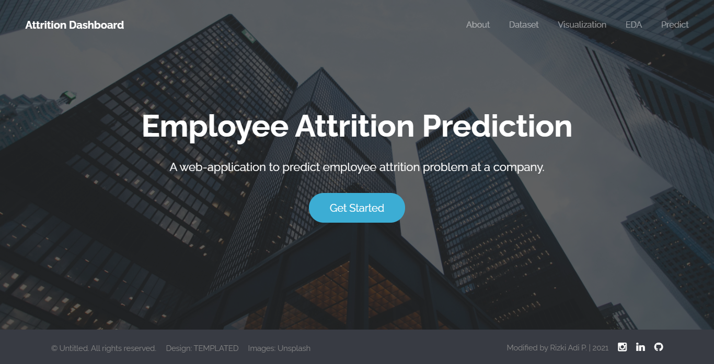
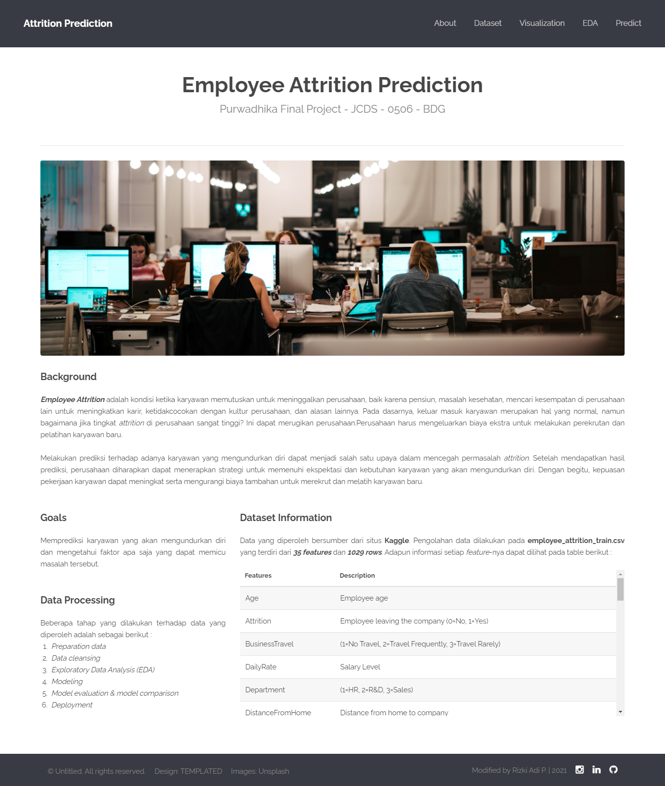
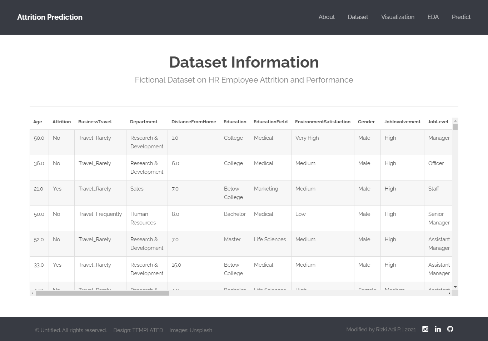
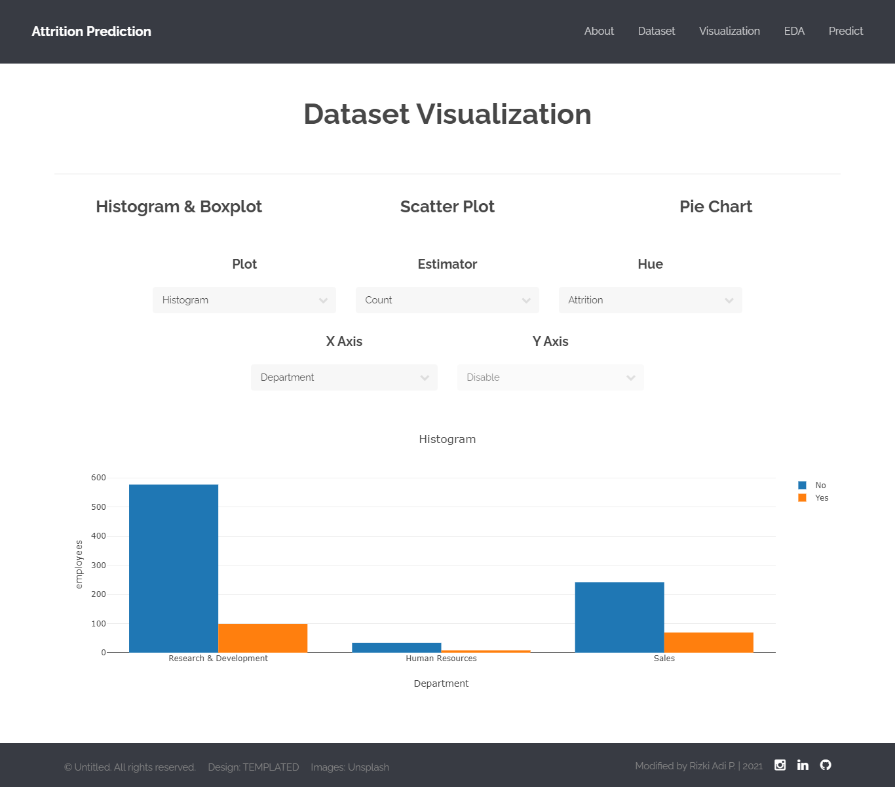
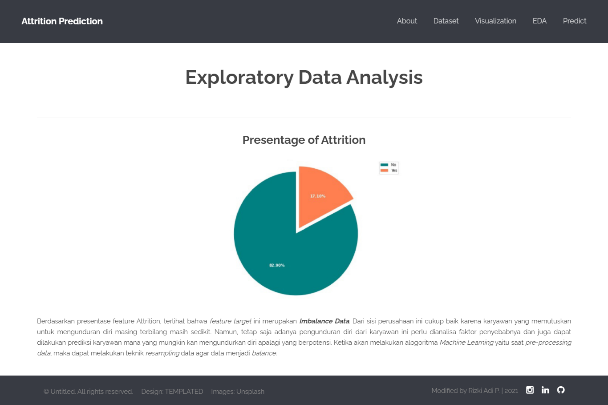
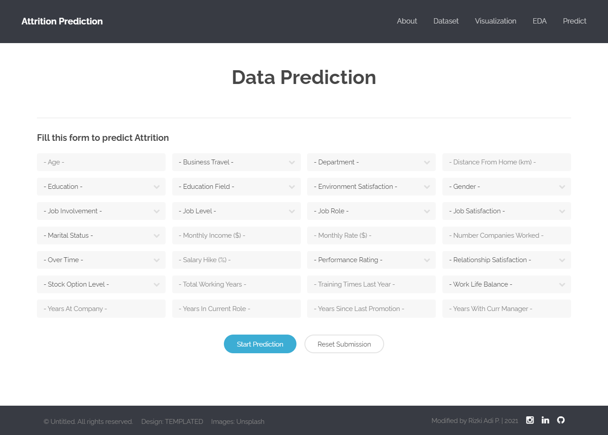
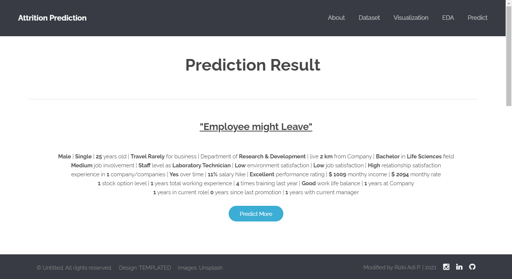

# Employee Attrition Prediction 

## Background 
Employee Attrition adalah kondisi ketika karyawan memutuskan untuk meninggalkan perusahaan, baik karena pensiun, masalah kesehatan, mencari kesempatan di perusahaan lain untuk meningkatkan karir, ketidakcocokan dengan kultur perusahaan, dan alasan lainnya. Pada dasarnya, keluar masuk karyawan merupakan hal yang normal, namun bagaimana jika tingkat attrition di perusahaan sangat tinggi? Ini dapat merugikan perusahaan.Perusahaan harus mengeluarkan biaya ekstra untuk melakukan perekrutan dan pelatihan karyawan baru.

Melakukan prediksi terhadap adanya karyawan yang mengundurkan diri dapat menjadi salah satu upaya dalam mencegah permasalah Attrition. Setelah mendapatkan hasil prediksi, perusahaan diharapkan dapat menerapkan strategi untuk memenuhi ekspektasi dan kebutuhan karyawan yang akan mengundurkan diri. Dengan begitu, kepuasan pekerjaan karyawan dapat meningkat serta mengurangi biaya tambahan untuk merekrut dan melatih karyawan baru.

## Goal
Memprediksi karyawan yang akan mengundurkan diri dan mengetahui faktor apa saja yang dapat memicu masalah tersebut.

## Datasets
Data yang diperoleh bersumber dari situs [Kaggle](https://www.kaggle.com/colearninglounge/employee-attrition). Pengolahan data dilakukan pada employee_attrition_train.csv yang terdiri dari 35 features dan 1029 rows. 

## Data Processing
Beberapa tahap yang dilakukan terhadap data yang diperoleh adalah sebagai berikut :
1. Preparation data
2. Data cleansing
3. Exploratory Data Analysis (EDA)
4. Modeling
5. Model evaluation & model comparison
6. Deployment

## Dashboard Preview
### Home Page

### About Page

### Dataset Page

### Visualization Page

### EDA Page

### Predict Page

### Result Page

